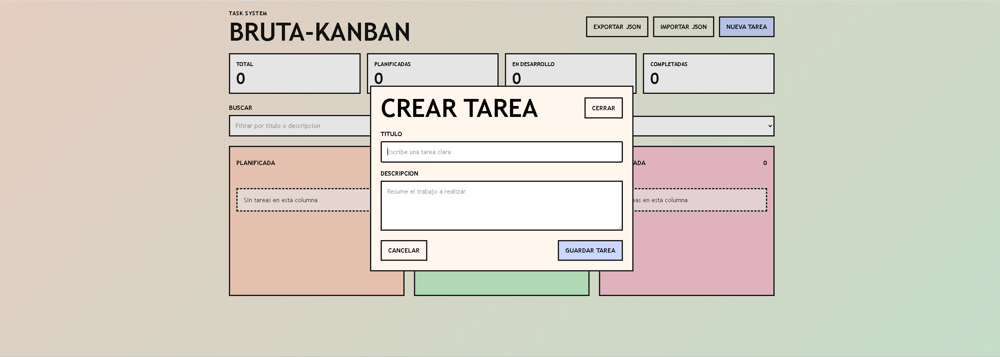
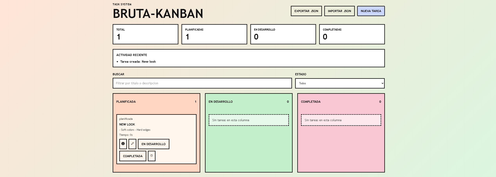
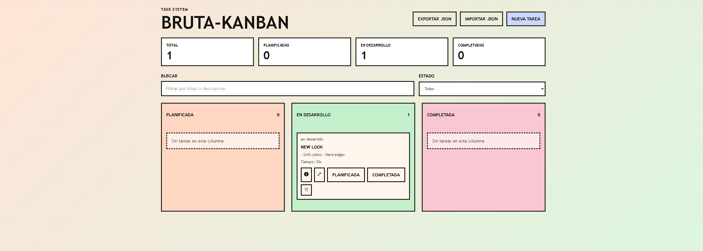
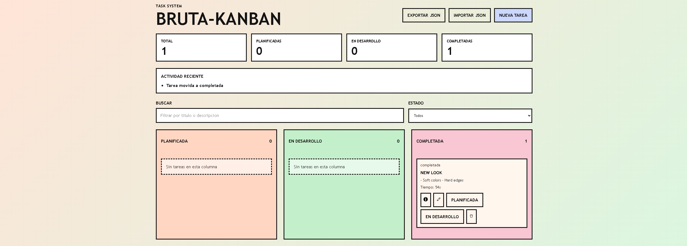
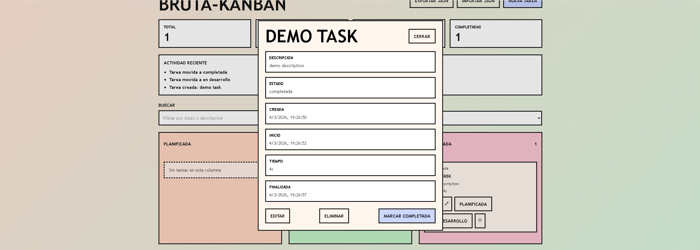

# BRUTA-KANBAN

<div align="center">

### Choose your language / Elige tu idioma

<a href="#english-version">English</a> &nbsp;&nbsp;&nbsp;&nbsp; <a href="#version-en-espanol">Espanol</a>

</div>

---

<a name="english-version"></a>
## English Version

Native kanban task manager built only with HTML, CSS, and JavaScript. The goal is to prove that a modular, reactive, component-oriented application can work cleanly without frameworks or external dependencies.

**[Ver version en espanol](#version-en-espanol)**

## Features

### Task Board
- Three workflow states: `planificada`, `en desarrollo`, and `completada`
- Create, edit, delete, and inspect tasks through native `dialog` elements
- Drag and drop between columns and manual ordering inside each column
- Recent activity panel and board summary feedback

### Persistence
- IndexedDB storage through a dedicated service layer
- Automatic persistence when tasks are created, edited, moved, deleted, imported, or updated by timers
- Filter preferences stored locally in browser storage
- JSON import and export for task backups

### Time Tracking
- Each task stores creation, start, and completion timestamps
- While a task is in `en desarrollo`, elapsed time updates every second
- Time display adapts between seconds, minutes, and hours depending on duration

### Native Reactivity
- Lightweight store for application state
- Event-driven communication built on top of `EventTarget` and `CustomEvent`
- UI modules subscribe to state changes and re-render when needed

## Screenshots

| Create task | Task in planning |
|:-----------:|:----------------:|
|  |  |

| Task in development | Task completed |
|:-------------------:|:--------------:|
|  |  |

| Task detail |
|:-----------:|
|  |

## Design Philosophy

This project follows a brutalist UI direction: hard edges, clear structure, direct interactions, and no framework abstraction hiding browser behavior.

Instead of relying on a virtual DOM or a component library, the application is intentionally built close to the platform. The point is not minimalism for its own sake, but control: explicit rendering, explicit state updates, explicit persistence, and small modules that are easy to reason about.

The result is a task board that feels simple on the surface while still covering real application concerns such as local persistence, validation, drag and drop, filtering, and progressive UI feedback.

## Technical Architecture

### Main Stack
```text
Native Browser Stack
|- HTML5
|- CSS3
|- JavaScript (ES Modules)
|- IndexedDB
|- EventTarget + CustomEvent
`- dialog element
```

### Project Structure
```text
index.html
src/
|- app.js                         # Composition root and app wiring
|- components/
|  |- base/                       # Shared base controls
|  |- board/                      # Kanban board, columns, cards, lists
|  |- buttons/                    # Reusable button component
|  |- dialogs/                    # Task creation and task detail dialogs
|  |- feedback/                   # Board summary, activity log, toast
|  `- inputs/                     # Text input and textarea controls
|- core/                          # Store, events, task rules, filters, import, ids
|- services/                      # IndexedDB persistence layer
`- styles/                        # Global visual system
test/
|- components/                    # Native JS component tests
|- core/                          # State and utility tests
`- services/                      # Persistence tests
```

### Data Flow
- `src/app.js` is the composition root that wires store, event bus, services, and UI modules
- Components emit semantic events such as `task:create`, `task:move`, `task:update`, and `filter:update`
- The store broadcasts changes to mounted components, which re-render from current state
- Persistence is debounced to avoid unnecessary IndexedDB writes during fast interactions

### Core Runtime Behavior
- Active development tasks increment `elapsedSeconds` every second
- Ordering is normalized so each task keeps a stable explicit `order`
- Import logic sanitizes incoming JSON before it reaches the app state
- Status rules restrict invalid transitions between task states

## How To Run

### Local Usage
This project does not require a build step or package installation.

Open `index.html` in a modern browser with ES module support and the app is ready to use.

### Data Storage
- Tasks are persisted in IndexedDB inside the browser
- Filters are persisted in local browser storage
- Exported backups are generated as JSON files from the UI

## Testing

The project uses plain JavaScript tests with no external test runner.

Example commands:

```bash
node --experimental-modules test/core/TaskState.test.js
node --experimental-modules test/components/board/TaskBoard.test.js
node --experimental-modules test/services/IndexedDbService.test.js
```

These tests cover:
- rendering helpers and template output
- task ordering and transition rules
- import sanitization and ID generation
- IndexedDB service behavior
- key UI component rendering

## Why This Project Exists

This application is a deliberate exercise in mastering browser fundamentals.

The objective is to build something that feels like a real product while staying inside the native platform: no frameworks, no external state libraries, no UI kits. That constraint forces clearer architecture decisions and makes the flow of state, rendering, and persistence easier to inspect.

## Author
**Yoel Villa**
- LinkedIn: [/in/yoel-villa](https://www.linkedin.com/in/yoel-villa)
- GitHub: [@95yoel](https://github.com/95yoel)

---

<a name="version-en-espanol"></a>
## Version en Espanol

Gestor de tareas tipo kanban construido solo con HTML, CSS y JavaScript nativos. El objetivo es demostrar que una aplicacion modular, reactiva y orientada a componentes puede mantenerse limpia sin frameworks ni dependencias externas.

**[View English version](#english-version)**

## Caracteristicas

### Tablero de Tareas
- Tres estados de flujo: `planificada`, `en desarrollo` y `completada`
- Creacion, edicion, eliminacion y detalle de tareas mediante elementos `dialog` nativos
- Drag and drop entre columnas y orden manual dentro de cada columna
- Panel de actividad reciente y resumen del tablero

### Persistencia
- Almacenamiento en IndexedDB mediante una capa de servicio dedicada
- Persistencia automatica cuando las tareas se crean, editan, mueven, eliminan, importan o se actualizan por temporizador
- Preferencias de filtros guardadas en almacenamiento local del navegador
- Importacion y exportacion JSON para copias de seguridad

### Seguimiento de Tiempo
- Cada tarea guarda timestamps de creacion, inicio y finalizacion
- Mientras una tarea esta en `en desarrollo`, el tiempo transcurrido se actualiza cada segundo
- El formato visible cambia entre segundos, minutos y horas segun la duracion

### Reactividad Nativa
- Store ligero para el estado global
- Comunicacion orientada a eventos sobre `EventTarget` y `CustomEvent`
- Los modulos de UI se suscriben a cambios y se renderizan cuando hace falta

## Capturas de Pantalla

| Crear tarea | Tarea planificada |
|:-----------:|:-----------------:|
|  |  |

| Tarea en desarrollo | Tarea completada |
|:-------------------:|:----------------:|
|  |  |

| Detalle de tarea |
|:----------------:|
|  |

## Filosofia de Diseno

Este proyecto sigue una direccion visual brutalista: bordes duros, estructura clara, interacciones directas y sin capas de abstraccion que oculten el comportamiento real del navegador.

En lugar de depender de un virtual DOM o de una libreria de componentes, la aplicacion esta construida intencionadamente cerca de la plataforma. La idea no es el minimalismo por si mismo, sino el control: renderizado explicito, cambios de estado explicitos, persistencia explicita y modulos pequenos que se entienden rapido.

El resultado es un tablero de tareas sencillo en apariencia, pero capaz de cubrir necesidades reales como persistencia local, validacion, drag and drop, filtros y feedback progresivo en la interfaz.

## Arquitectura Tecnica

### Stack Principal
```text
Stack Nativo del Navegador
|- HTML5
|- CSS3
|- JavaScript (ES Modules)
|- IndexedDB
|- EventTarget + CustomEvent
`- dialog element
```

### Estructura del Proyecto
```text
index.html
src/
|- app.js                         # Composition root y cableado principal
|- components/
|  |- base/                       # Controles base compartidos
|  |- board/                      # Tablero, columnas, tarjetas y listas
|  |- buttons/                    # Componente de boton reutilizable
|  |- dialogs/                    # Dialogos de crear y detalle de tarea
|  |- feedback/                   # Resumen, actividad y toast
|  `- inputs/                     # Text input y textarea
|- core/                          # Store, eventos, reglas, filtros, import, ids
|- services/                      # Capa de persistencia IndexedDB
`- styles/                        # Sistema visual global
test/
|- components/                    # Tests nativos de componentes
|- core/                          # Tests de estado y utilidades
`- services/                      # Tests de persistencia
```

### Flujo de Datos
- `src/app.js` actua como composition root y conecta store, bus de eventos, servicios y modulos de UI
- Los componentes emiten eventos semanticos como `task:create`, `task:move`, `task:update` y `filter:update`
- El store difunde cambios a los componentes montados, que se vuelven a renderizar desde el estado actual
- La persistencia se hace con debounce para evitar escrituras innecesarias en IndexedDB durante interacciones rapidas

### Comportamiento Interno
- Las tareas activas en desarrollo incrementan `elapsedSeconds` cada segundo
- El orden se normaliza para que cada tarea mantenga un valor `order` estable
- La importacion sanea el JSON antes de incorporarlo al estado de la aplicacion
- Las reglas de estado bloquean transiciones invalidas entre columnas

## Como Ejecutarlo

### Uso Local
Este proyecto no necesita build ni instalacion de paquetes.

Abre `index.html` en un navegador moderno con soporte para ES modules y la aplicacion quedara lista para usarse.

### Almacenamiento
- Las tareas se guardan en IndexedDB dentro del navegador
- Los filtros se guardan en almacenamiento local del navegador
- Las copias de seguridad se exportan como archivos JSON desde la interfaz

## Testing

El proyecto usa tests en JavaScript puro, sin framework externo.

Comandos de ejemplo:

```bash
node --experimental-modules test/core/TaskState.test.js
node --experimental-modules test/components/board/TaskBoard.test.js
node --experimental-modules test/services/IndexedDbService.test.js
```

Estos tests cubren:
- helpers de renderizado y salida de templates
- reglas de transicion y orden de tareas
- saneado de importaciones y generacion de IDs
- comportamiento del servicio de IndexedDB
- renderizado de componentes clave

## Por Que Existe Este Proyecto

Esta aplicacion es un ejercicio deliberado para dominar los fundamentos del navegador.

La meta es construir algo que se sienta como un producto real manteniendose dentro de la plataforma nativa: sin frameworks, sin librerias externas de estado, sin UI kits. Esa restriccion obliga a tomar decisiones de arquitectura mas claras y hace que el flujo de estado, renderizado y persistencia sea mas facil de inspeccionar.

## Autor
**Yoel Villa**
- LinkedIn: [/in/yoel-villa](https://www.linkedin.com/in/yoel-villa)
- GitHub: [@95yoel](https://github.com/95yoel)
